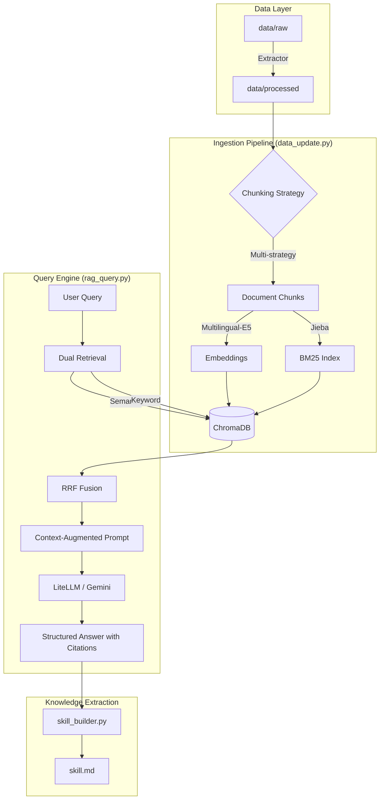

# 臺灣碳費與歐盟 CBAM 規範問答系統 (Taiwan Carbon Market RAG)

本專案建立了一個專業的 RAG (Retrieval-Augmented Generation) 系統，旨在提供精確的臺灣碳費徵收機制、自主減量計畫以及歐盟 CBAM (碳邊境調整機制) 規範的資訊查詢。

## 1. 專案簡介

- **知識主題**：臺灣碳費政策、溫室氣體排放趨勢、自主減量計畫指引及歐盟 CBAM 規範。選擇此主題是因為隨著全球淨零轉型，碳費與 CBAM 已成為企業與政策制定者最關心的法律合規議題。
- **資料來源**：
  - 臺灣 2025 國家溫室氣體清冊報告（包含能源、工業、農業、廢棄物等各部門）。
  - 臺灣碳費子法系列（徵收費率、收費辦法、自主減量計畫管理辦法等）。
  - 氣候變遷因應法條文。
  - 歐盟 CBAM 法規文件及臺灣碳權市場趨勢報告。
  - 總量約 20+ 份文件，涵蓋 PDF、TXT、HTML 格式。
- **技術選型**：
  - **Embedding**: `intfloat/multilingual-e5-small` (本地運行)
  - **Vector DB**: ChromaDB (本地持久化)
  - **Retrieval**: Hybrid Search (Dense Vector + BM25) + Reciprocal Rank Fusion (RRF)
  - **LLM**: Gemini 2.5 Flash (經由 LiteLLM)

---

## 2. 系統架構說明



---

## 3. 設計決策說明 (Design Decisions)

- **Chunking 策略**：
  - **多策略切分 (Multi-strategy)**：系統會自動偵測文件結構。對於臺灣法規，依「第 X 條」切分；對於歐盟法規，依「Article X」切分；對於統計報告，依數位/中文大綱層級切分。
  - ** Context Injection**：在每個 Chunk 開頭注入該章節的標題（例如 `[第十二條] ...`），確保檢索出的片段帶有完整的語境。
  - **Overlap 設定**：Fallback 模式下設定 2 行 Overlap，確保跨片段的文意流暢。
- **Embedding 模型選擇**：
  - 選用 **`intfloat/multilingual-e5-small`**。
  - **理由**：相較於一般的模型，E5 在中英文混合語境下表現極佳；且此為 Instruct-based 模型，在檢索時加上 `query: ` 與 `passage: ` 前綴能大幅提升匹配精準度。選用 `small` 版本是為了在本地環境下保持高效能。
- **Vector DB 選型**：選用 **ChromaDB**。理由是其完全本地化、部署簡單，且原生支持 Embedding 與 Metadata 儲存，非常適合現階段的開發與複現需求。
- **Retrieval 策略**：
  - **Hybrid Search + RRF**：結合了語意檢索 (Dense) 與關鍵字檢索 (BM25)。對於專有名詞（如「自主減量計畫」）關鍵字檢索極強，而對於概念性問題則由語意檢索補足。使用 **Reciprocal Rank Fusion (RRF, k=60)** 將兩者結果融合，取 top-5。
- **Prompt Engineering**：
  - 設定 AI 角色為「臺灣法規與碳市場專家」。
  - 強制 LLM **「嚴格遵守提供的 Context」**，若無法從 Context 得知答案則誠實說明，避免幻覺。
  - 要求以 `[1][2]` 標註來源，並自動在結果下方列出詳細的引用清單（含文件名與具體條次）。
- **Idempotency 設計**：
  - `data_update.py` 使用 **SHA256 文件雜湊值**。系統會記錄已處理文件的雜湊於 `.hashes.json`，若原始文件未變動則跳過提取階段，節省資源。
- **skill_builder.py 問題設計**：
  - 設計了涵蓋「徵收機制」、「優惠費率條件」、「歐盟 CBAM 計算」與「國家清冊主辦單位」四大範疇的問題。目的是確保產出的 `skill.md` 能作為系統核心知識的摘要，並驗證 RAG 的檢索涵蓋率。

---

## 4. 環境設定與執行方式

### 4-1. Python 版本與虛擬環境

本專案要求 **Python 3.10+** (開發環境為 `3.10.20`)。

```bash
# Step 1：建立虛擬環境
python3 -m venv .venv

# Step 2：啟動虛擬環境
source .venv/bin/activate

# Step 3：安裝套件
pip install -r requirements.txt
```

### 4-2. 環境變數設定

請複製範例設定檔並填入您的 API Key：

```bash
cp .env.example .env
# 請編輯 .env 填入 GEMINI_API_KEY
```

### 4-3. 完整執行流程

請確保您已完成上述環境設定，接著按順序執行以下指令：

```bash
# ① 全量重建索引（含 text 提取、清洗、切分與 Embedding 入庫）
python data_update.py --rebuild

# ② 執行交互式問答 (或單次查詢)
# 交互式問答：
python rag_query.py
# 單次查詢示例：
python rag_query.py --query "哪些事業需要繳交碳費？" --top-k 5

# ③ 生成領域知識摘要 Skill 文件
python skill_builder.py --output skill.md
```

---

## 5. 資料來源聲明 (Data Sources Statement)

| 來源名稱 | 類型 | 授權 / 合規依據 | 數量 |
2025 國家溫室氣體清冊報告 | PDF/TXT | 臺灣政府公開資訊 | 8 份 |
碳費子法系列 (徵收辦法、費率等) | PDF | 臺灣環境部公告 | 6 份 |
歐盟 CBAM 規範文件 | HTML | EU Official Journal (Open Access) | 2 份 |
氣候變遷因應法 | TXT | 臺灣全國法規資料庫 | 1 份 |
臺灣碳權市場趨勢報告 | TXT | 台灣碳權交易所/公開研究 | 1 份 |

---

## 6. 系統限制與未來改進

1. **PDF 解析精度**：目前的 PDF 解析器對於表格與公式的提取仍有改進空間。未來可引入視覺導向的解析器 (如 Layout-aware parsers)。
2. **Reranking 缺失**：目前的 RRF 混合檢索效果不錯，但若能在最後階段引入 Cross-Encoder 進行 Reranking，精準度會更高。
3. **動態更新機制**：目前入庫為手動全量或增量，未來可發展 API 介面自動監測政府公報進行實時更新。