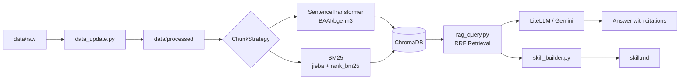

# 臺灣碳費與歐盟 CBAM 規範問答系統 (Taiwan Carbon Market RAG)

本專案建立了一個面向臺灣碳費、溫室氣體清冊、自主減量計畫與歐盟 CBAM 規範的 RAG (Retrieval-Augmented Generation) 系統，讓使用者能以自然語言查詢法規與政策內容，並取得可追溯來源的答案。

## 1. 專案簡介

- **知識主題**：臺灣碳費政策、溫室氣體排放清冊、碳費與自主減量配套文件、歐盟 CBAM 規範，以及少量補充研究資料。
- **資料規模**：目前原始資料共 **68 份**，包含 **63 份 PDF、3 份 TXT、2 份 HTML**；處理後會統一轉成 `data/processed/` 下的純文字檔供檢索使用。
- **資料來源類型**：政府公開報告、法規條文、行政規則、官方問答/指引、EU 官方公開文件與少量公開研究資料。
- **系統定位**：重點不是生成式聊天，而是把法規與報告內容整理成可檢索、可引用、可重現的知識庫。

## 2. 系統架構說明



## 3. 設計決策說明 (Design Decisions)

- **Chunking 策略**：
  - `src/chunker.py` 會先自動偵測文件型態，優先辨識臺灣法規條文（`第 X 條`）、EU `Article X`、表格/附表、數字章節（`1.1`）與中文大綱（`一、`）等結構。
  - 若能辨識結構，就以該結構切段；若無法辨識，才退回段落式切分。
  - 預設 `max_chunk_size = 250`，`overlap_lines = 2`，並在 chunk 開頭注入章節/條文標題，讓檢索結果保留語境。
- **Embedding 模型選擇**：
  - 使用本地 Hugging Face 模型 **`BAAI/bge-m3`**。
  - 這個模型適合中英文混合的法規與政策文本，且不依賴外部 embedding API，方便離線重建與重複執行。
  - 目前向量化流程在寫入 ChromaDB 前直接本地執行，減少外部服務依賴。
- **Vector DB 選型**：
  - 使用 **ChromaDB**，原因是安裝簡單、可本地持久化、適合本專案的中小型知識庫。
  - 同時搭配 BM25 快取檔 `db/chroma/bm25.pkl`，避免每次查詢都重建稀疏索引。
- **Retrieval 策略**：
  - 採用 **Dense Retrieval + BM25** 的混合檢索。
  - `rag_query.py` 會把兩種結果做 **Reciprocal Rank Fusion (RRF, k=60)**，再取前 `top-k` 筆送入 LLM。
  - 預設 `top-k = 5`，兼顧上下文完整性與 prompt 長度。
- **Prompt Engineering**：
  - 系統提示要求模型以與問題相同的語言回答，並且只能依據提供的 context 作答。
  - 若 context 不足，模型必須明確說明無法判定，而不是補作推測。
  - 回答時要求附上 `[1][2]` 形式的來源標記，讓前端與使用者都能追溯引用段落。
- **Idempotency 設計**：
  - `data_update.py` 會對 raw 檔案計算 SHA256，並將雜湊寫入 `data/processed/.hashes.json`。
  - 若 raw 檔未變動且對應的 processed `.txt` 已存在，就會跳過提取，避免重複處理。
  - `--rebuild` 會先清除舊的 processed artifacts，再重新跑 extraction / cleaning / ingestion。
- **skill_builder.py 問題設計**：
  - `skill_builder.py` 會從同一批知識庫資料萃取領域摘要，最後輸出為 `skill.md`。
  - 問題設計涵蓋碳費、優惠費率、自主減量、CBAM 與清冊主責單位等核心主題，讓 `skill.md` 成為這個 RAG 的高層摘要與測試輸出。

## 4. 環境設定與執行方式

### 4-1. Python 版本與虛擬環境

本專案要求 **Python 3.10 以上**；開發與驗證環境為 **Python 3.10.20**。

```bash
python3 --version
python3 -m venv .venv
source .venv/bin/activate
pip install -r requirements.txt
```

### 4-2. 環境變數設定

本專案已提供 `.env.example`，請複製成 `.env` 後填入可用的 API key。

```bash
cp .env.example .env
```

若你直接使用 Gemini，至少需要設定：

- `GEMINI_API_KEY`

若你透過 LiteLLM proxy，也可改用：

- `LITELLM_API_KEY`
- `LITELLM_BASE_URL`

### 4-3. 完整執行流程

```bash
# ① 建立虛擬環境並安裝依賴
python3 -m venv .venv
source .venv/bin/activate
pip install -r requirements.txt

# ② 設定環境變數
cp .env.example .env

# ③ 全量重建索引（raw → processed → ChromaDB）
python data_update.py --rebuild

# ④ 查詢 RAG
python rag_query.py --query "哪些事業需要繳交碳費？" --top-k 5

# ⑤ 生成領域知識摘要
python skill_builder.py --output skill.md
```

### 4-4. 重要補充

- `data_update.py` 的預設 raw 目錄是 `data/raw`，也可以明確指定：`python data_update.py data/raw --rebuild`。
- 本專案使用 **ChromaDB 本地持久化**，不需要另外啟動 `docker-compose`。
- `rag_query.py` 會先載入 `.env`，再初始化 `VectorStore` 與 `RAGQuery`。

## 5. 資料來源聲明 (Data Sources Statement)

| 來源名稱 | 類型 | 授權 / 合規依據 | 數量 |
|---|---|---|---:|
| 臺灣政府公開文件（2025 國家溫室氣體清冊報告、碳費與自主減量相關文件） | PDF / TXT | 臺灣政府公開資訊與法規資料庫 | 66 份 |
| 歐盟公開文件（CBAM / Official Journal / EU 公報） | HTML | EU Official Journal Open Access | 2 份 |

> 補充說明：目前 raw 資料總數為 68 份，格式分布為 63 PDF、3 TXT、2 HTML。

## 6. 系統限制與未來改進

1. **PDF 解析仍有表格/版面雜訊**：部分 PDF 在轉成純文字時仍會出現表格重排、欄位斷裂或編號碎片，後續可再加強版面感知的解析流程。
2. **未加入 reranker**：目前是 Dense + BM25 + RRF，若再加 Cross-Encoder reranking，答案對條文/數字題通常會更穩。
3. **更新仍以批次為主**：目前是手動或半自動重建索引，若未來要接近即時更新，可再做 API 或排程整合。